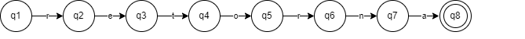
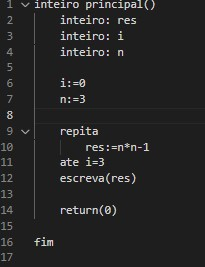

# Projeto de Implementação de um Compilador para a Linguagem TPP: Análise Léxica (Trabalho – 1ª parte)
#### Gustavo Kioshi Asato
#### Ciencia da Computação – Universidade Tecnológica Federal do Paraná (UTFPR)
## 1 Análisador Léxico
Nessa atividade desenvolvida durante a disciplina de Compiladores tem em foco desenvolver um analisador léxico que funcina como um sistema de varedura no codigo a ser compilado, separando os tokens. Os tokens são definidos no compilador sendo palavras reservadas ou símbolos. Cada token pode receber os proximos caracteres de acordo com a sua implementação de forma com que cada token possa ter uma entrada necessaria para retornar para oque foi designada.
### 2 Linguagem T++
A linguagem T++ possui os seguintes tipos suportados interio e flutuante podendo ser armazenados em arrays unidimensional ou bidimensional. O tipo de aquivo para ser reconhecido como .tpp no final do arquivo.
### 2.1 Tokens
Os tokens são pré-definidos na criação do compilador. Sendo chamada toda vez que aparece no codigo a ser compilado, cada token possui uma ação especifica podendo tomar diversas descisões com determinados parametros que foram submetidos.
### 2.2 Tabela de tokens

##### Operadores
Os tokens de operadores é responsavel pela a mudança e comparação de identificadores. 
|token          |simbolo|
|---------------|------|
| MAIS          | +    |
| MENOS         | -    |
| MULTIPLICACAO | *    |
| DIVISAO       | /    |
| E_LOGICO      | &&   |
| OU_LOGICO     | \|\| |
| DIFERENCA     | <>   |
| MENOR_IGUAL   | <=   |
| MAIOR_IGUAL   | >=   |
| MENOR         | <    |
| MAIOR         | >    |
| IGUAL         | =    |
| NEGACAO       | !    |

##### simbolos
Na gramatica utilizada esses simbolos são utilizados para dar ordem a identificadores e preferencia de que opreração realizara primeiro.
|token          |simbolo|
|---------------|------|
| ABRE_PARENTESE| (    |
| FECHA_PARENTESE| )    |
| ABRE_COLCHETE | [    |
| FECHA_COLCHETE|  ]   |
| VIRGULA      | ,   |
| DOIS_PONTOS    | :  |
| ATRIBUICAO     | :=  |

##### palavras reservadas
Alguns tokens da Linguagem T++ são identificados como palavras reservadas que por sua vez não são possiveis de serem utilizados como identificadores como ela é responsavel pela gramatica da linguagem sendo representada na figura abaixo.
|token          |simbolo|
|---------------|------|
| SE|se   |
| ENTAO| então   |
| SENAO | senão   |
| FIM| fim  |
| REPITA      | repita  |
| FLUTUANTE    | flutuante |
| RETORNA     | retorna |
| ATE| até  |
| LEIA      | leia  |
| ESCREVA    | escreva  |
| INTEIRO     |inteiro |

## 3 Linguagens de programação para a implementação
### 3.1 Python
O Python é uma linguagem de programação de alto nível utilizada em diferentes tipos de aplicações, em Machine Learning, no desenvolvimento de jogos. Sendo necessario para utilizar para poder compilar os codigos.
### 3.2 PLY
O PLY é uma biblioteca para python que permite desenvolver um compilador sendo necessario durante todo o desenvolvimento do projeto 
### 3.3 Autômato
Durante todo o codigo a ser compilado por definição o processo de identificação dos tokens utiliza autômaros finitos e expressões regulares. Que por sua vez tem como objetivo identificar todas as cadeias de caracteres.
Na figura abaixo demonstra um autômato da palavra "retorna"

## 4 Testes
### 4.1 Execução do codigo
Para testar codigo foi utilizado um codigo de entrada da linguagem T++ que realiza o fatorial

