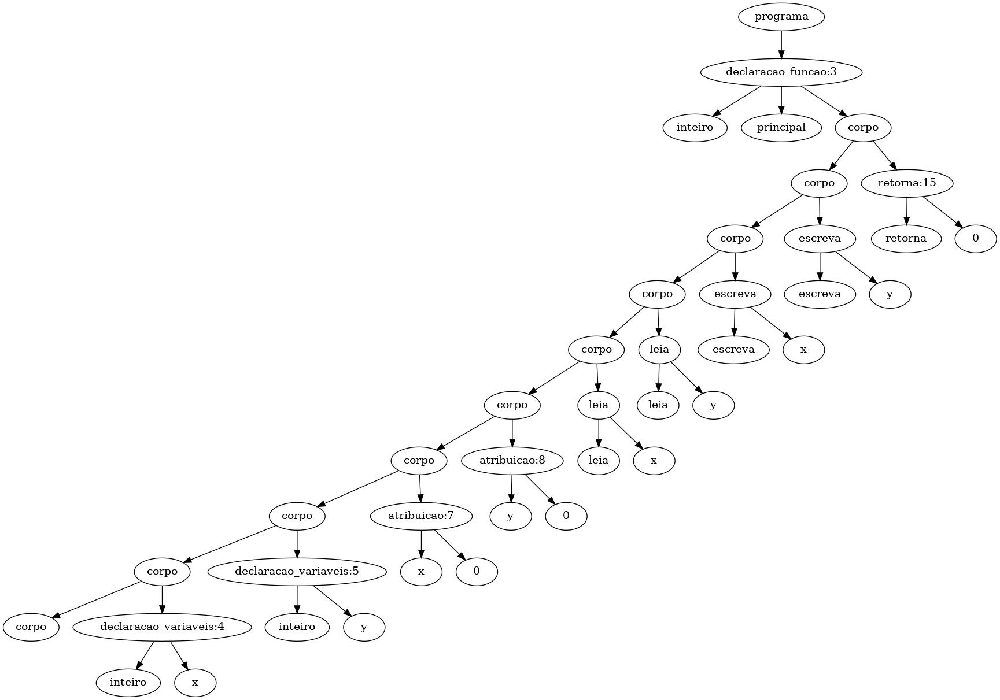

# Projeto de Implementação de um Compilador para a Linguagem TPP: Geração de Codigo (Trabalho – 4ª parte)
#### Gustavo Kioshi Asato
#### Ciencia da Computação – Universidade Tecnológica Federal do Paraná (UTFPR)

## 1 Geração de Codigo
Nessa atividade, discutiremos uma implementação de geração de código. A geração de código é uma técnica utilizada por desenvolvedores para automatizar a criação de código fonte de programas de computador a partir de uma especificação ou de um modelo de alto nível. Isso pode ajudar a economizar tempo e esforço, além de garantir a consistência e a qualidade do código gerado. A implementação de geração de código é baseada em regras de transformação que são aplicadas a um modelo de alto nível, produzindo código fonte em uma linguagem de programação específica. Além disso, a nossa implementação inclui recursos para testar e validar o código gerado, garantindo sua correção e funcionalidade.

### 2 Especificação da Linguagem T++
Com base na arvore gerada no tppparse.py ela é podada de forma que possua somente a parte mais importante das ações realizadas no codigo. Sendo percorrida da direita para a esquerda 

Codigo a ser testado pelo compilador na parte de geração de codigo.
~~~TPP
inteiro principal()	
	inteiro: x
	flutuante: y
	
	x := 0
	y := 0.0
	
	leia(x)
	leia(y)
	escreva(x)
	escreva(y)
	
    retorna(0)
fim
~~~

resultado a ser realizado pela maquina que esta utilizando 

~~~TPP
; ModuleID = "modulo.bc"
target triple = "x86_64-unknown-linux-gnu"
target datalayout = "e-m:e-p270:32:32-p271:32:32-p272:64:64-i64:64-f80:128-n8:16:32:64-S128"

declare void @"escrevaInteiro"(i32 %".1")

declare void @"escrevaFlutuante"(float %".1")

declare i32 @"leiaInteiro"()

declare float @"leiaFlutuante"()

define i32 @"main"()
{
"principal:entry":
  %".2" = alloca i32
  store i32 0, i32* %".2"
  %"x" = alloca i32, align 4
  store i32 0, i32* %"x"
  %"y" = alloca i32, align 4
  store i32 0, i32* %"y"
  store i32 0, i32* %"x"
  store i32 0, i32* %"y"
  %".8" = load i32, i32* %"x", align 4
  %".9" = call i32 @"leiaInteiro"()
  store i32 %".9", i32* %"x", align 4
  %".11" = load i32, i32* %"y", align 4
  %".12" = call i32 @"leiaInteiro"()
  store i32 %".12", i32* %"y", align 4
  %".14" = load i32, i32* %"x"
  call void @"escrevaInteiro"(i32 %".14")
  %".16" = load i32, i32* %"y"
  call void @"escrevaInteiro"(i32 %".16")
  br label %"exit"
exit:
  ret i32 0
}
~~~

## 3 Procedimentos
Para que seja possivel desenvolver o codigo foi feito em python com a biblioteca llvmlite que possui uma API que LLVM mapeamentop de memória no estilo C++ para python sendo um construtor IR, otimizador, e APIs do compilador JIT são necessárias.
cria o codigo .ll
~~~
python3 generatecode.py geracao-codigo-testes/gencode-017.tpp
~~~

~~~
llvm-link vars.ll io.ll -o vars-liked.ll 
~~~
cria um executavel
~~~
clang vars-liked.ll -o vars.exe
~~~
roda o executavel
~~~
./vars.exe 
~~~
mostra o retorno da main
~~~
echo $?
~~~

## 5 Referencias

https://github.com/rogerioag/llvm-gencode-samples
https://pypi.org/project/llvmlite
https://llvmlite.readthedocs.io/en/latest

